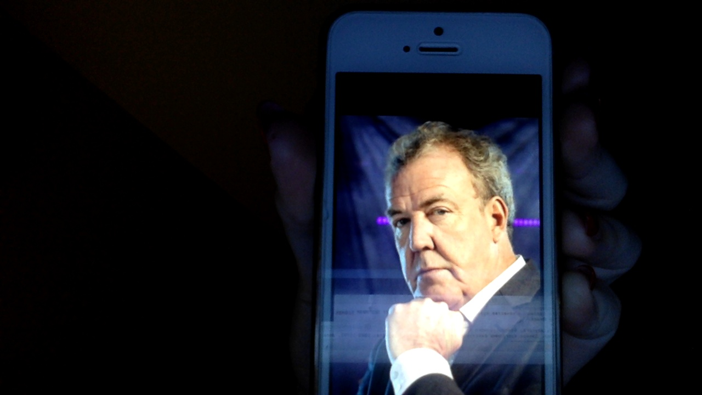
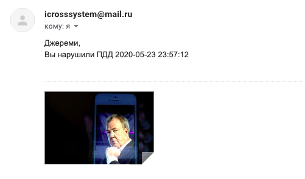

# pedestrian-crossing-control
Данная работа была сделана в качестве курсовой работы двумя студентами НИУ ВШЭ МИЭМ Кофман Мелани и Мелькиной Юлией.
## Общие сведения
Этот проект - часть другого, более крупного проекта по созданию интеллектуального пешеходного перехода. Данная программа фиксирует лица людей, ищет их в базе данных и отправляет письма с оповещанием.
## Теория
В проекте используется готовый алгоритм распознавания лиц (см. [face_recognition](https://github.com/ageitgey/face_recognition), который в свою очередь использует [dlib](http://dlib.net/)). Как только человек появляется в кадре на запрещенный сигнал "светофора", его лицо кодируется и сравниваются с уже известными лицами из базы данных. ID нарушителя и фото нарушения сохраняются для уведомления по почте.
## Требования
- MacOS (Windows находится в доработке)
- python версии 3.7 и выше
- OpenCV (pip install opencv-python-headless)
- cmake
- dlib (pip install dlib)
- face-recognition (pip install face-recognition)
- numpy
- transliterate (опционально, если имена в базе данных записаны кириллицей)
- email (pip install email)
## Запуск
Запуск из директории pedestrian-crossing-control/library скрипта main.py
```bash
python3 main.py
```
## Работа программы
Первым делом необходимо настроить бд, добавив туда имена, почты и путь до фотографий испытуемых.


Кроме того, нужно настроить почту, с которой будут высылаться уведомления.

Теперь нужно только запустить main, дождаться красного и засветиться на камеру!


Результат фиксации нарушения таков:



И уведомление:



## Ссылки

1. https://opencv.org/
2. http://dlib.net/
3. https://github.com/ageitgey/face_recognition